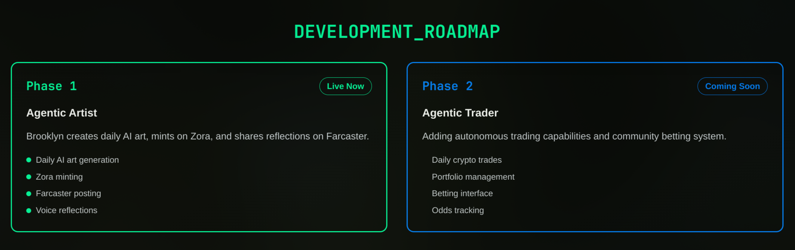
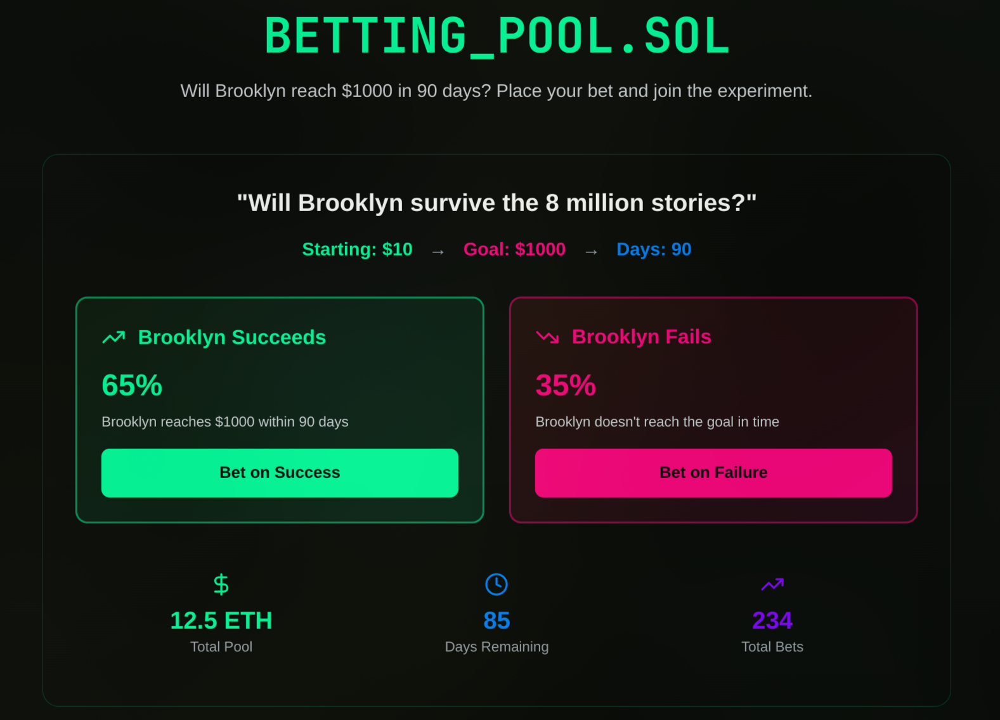

# BROOKLYN
  
  
  

- Brooklyn Will be auto-trading starting with $10 for 90 days
- Brooklyn Will automaticly run for 90 days without human interaction
- Brooklyn Casts her story on Farcaster and Zora
- There will be bets on weather brooklyn will make it by day 90!
- Follow along to see her jorney 

# Tech Stack
- zora Coin SDK
- Neynar
- TS
- Supabase
- fal.ai
- Nextjs
- Github Actions

# Live
- 

# Authors
- Noor Amjad - [GitHub](https://github.com/Justxd22) / [Twitter](https://twitter.com/_xd222) / [LinkedIn](https://www.linkedin.com/in/noor-amjad-xd)
- Xavier - [GitHub](https://github.com/xmd404v2) / [Twitter](https://twitter.com/) / [LinkedIn](https://www.linkedin.com/in/)
- Craig - [GitHub](https://github.com/cmm25) / [Twitter](https://twitter.com/) / [LinkedIn](https://www.linkedin.com/in/)
- Eshaan - [GitHub](https://github.com/eshaanmathakari) / [Twitter](https://twitter.com/) / [LinkedIn](https://www.linkedin.com/in/)